  

  
  
  

[English](README.md) · **日本語**

## 👋 自己紹介

- 🏢 **PKSHA Technology** でエンジニアリングマネージャー兼 FDE (Forward Deployed Engineer)
- 🪜 以前は PKSHA Communication の執行役員として AI SaaS プロダクト開発の SWE 全体を統括。PKSHA Communication と PKSHA Workplace は 2025 年 7 月に PKSHA Technology に吸収合併されました
- 🛤️ 2009 年から SI → ソーシャルゲーム → IoT・エッジ AI → AI SaaS と渡り歩き、エンジニア・リードエンジニア・エンジニアリングマネージャーを経験
- 🎤 [Microsoft Build 2023](https://speakerdeck.com/pkshadeck/azure-openai-servicewohuo-yong-sita-ai-saaspurodakutokai-fa-noshi-jian) と [SaaS on AWS 2023](https://speakerdeck.com/pkshadeck/saasniokerusheng-cheng-ai-noshi-zhuang-tosonowei-lai) で SaaS への生成 AI の組み込みについて登壇
- 🤖 Claude Code・Codex・Cursor・Devin を使った AI エージェント開発にも取り組んでいます
- 🏡 埼玉県在住、3 児の父
- ✍️ ブログ: [blog.taross-f.dev](https://blog.taross-f.dev/)

## 🧱 Shared Tower — Issue を立てるだけ。それ以外の準備は不要。

みんなで 1 本のタワーを積み上げます。Issue に x 座標をひとつ書くと、下の盤面にブロックが 1 個落ちてきます。
崩したらその周回のスコアが殿堂入りし、次の周回が空の土台から始まります。

<!-- BOARD:START -->

**[▶ 1手打つ](https://github.com/taross-f/taross-f/issues/new?template=play.yml)** — x 座標 (140–340) を書いて issue を立てるだけ。

| 周回 | 高さ | ブロック | 最高記録 |
|---:|---:|---:|---:|
| 1 | 97 px | 13 | 97 px |
<!-- BOARD:END -->

### 遊び方

1. **[Issue を立てる](https://github.com/taross-f/taross-f/issues/new?template=play.yml)** — ラベル `play` は自動で付きます
2. 本文に **140 〜 340 の整数** を 1 つだけ書く — これが投下する x 座標です
3. 1 分ほどで GitHub Actions が物理シミュレーションを回し、盤面と README を更新して Issue に返信します

| ルール | |
|:--|:--|
| 土台 | `x = 140` 〜 `340` の 200px。ここから外れたら落下 |
| ブロックの形 | Issue 番号から決まります。**選べません** |
| スコア | 一番高いブロックの頂点の高さ |
| 崩壊 | ブロックが台から落ちる、または高さが前ターンより 20px 以上減ったら |
| 連投 | 同じ人は 10 分に 1 回まで |

崩壊するとその周回のスコアが記録され、ブロックが片付けられて次の周回が始まります。
本文は **最初に現れる整数** を拾うので、`250` も `x=250` も `２５０` もすべて同じ意味になります。

## 🚀 経歴

  

## ⚡ 技術スタック

  

