  

  
  
  

**English** · [日本語](README.ja.md)

## 👋 About me

- 🏢 Executive Officer at **PKSHA Communication**, leading software engineering across its AI SaaS products
- 🛤️ In software since 2009 — systems integration → mobile games → IoT & edge AI → AI SaaS, as an engineer, lead engineer and engineering manager
- 🎤 Spoke about building generative AI into SaaS at [Microsoft Build 2023](https://speakerdeck.com/pkshadeck/azure-openai-servicewohuo-yong-sita-ai-saaspurodakutokai-fa-noshi-jian) and [SaaS on AWS 2023](https://speakerdeck.com/pkshadeck/saasniokerusheng-cheng-ai-noshi-zhuang-tosonowei-lai)
- 🤖 Hands-on with agentic development: Claude Code, Codex, Cursor and Devin
- 🏡 Based in Saitama, Japan. Father of three
- ✍️ Writing (in Japanese) at [blog.taross-f.dev](https://blog.taross-f.dev/)

  

## 🧱 Shared Tower — open an issue. There is no other setup.

Everyone stacks onto one shared tower. Put a single x coordinate in an issue and a block drops onto
the board below. Knock the tower over and its score goes to the hall of fame, then the next round
starts from an empty platform.

<!-- BOARD:START -->

**[▶ Drop a block](https://github.com/taross-f/taross-f/issues/new?template=play.yml)** — open an issue with one integer between 140 and 340. That is the whole game.

| Round | Height | Blocks | Best ever |
|---:|---:|---:|---:|
| 1 | 97 px | 13 | 97 px |
<!-- BOARD:END -->

### How to play

1. **[Open an issue](https://github.com/taross-f/taross-f/issues/new?template=play.yml)** — the `play` label is applied for you
2. Write one **integer between 140 and 340** in the body — the x coordinate you are dropping at
3. Within a minute GitHub Actions runs the physics, updates the board and this README, and replies on your issue

| Rule | |
|:--|:--|
| Platform | 200px wide, from `x = 140` to `340`. Leave it and you fall |
| Block shape | Derived from the issue number. **You do not get to choose** |
| Score | Height of the highest corner of any block |
| Collapse | A block leaves the platform, or the tower loses 20px or more against the previous turn |
| Cooldown | One drop per player every 10 minutes |

On a collapse the round's score is recorded, the blocks are cleared, and a new round begins.
The **first integer** in the body wins, so `250`, `x=250` and `２５０` all mean the same thing.

## 🚀 Career

  

## ⚡ Tech stack

  

---

